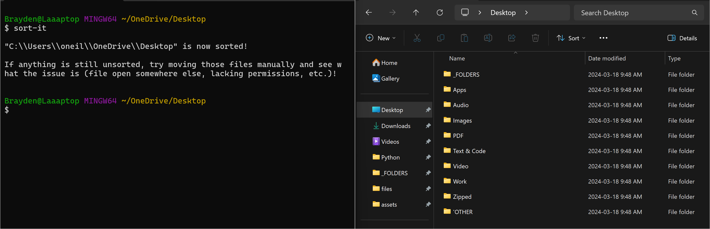

# Sort It

**This program sorts every file and folder inside of a directory with one command!**

# How are your folders sorted?

#### Your files are sorted into 10 different folders:

- **_FOLDERS**: Folder Type files.
- **Apps**: Application Type files (Installers, executables, etc.).
- **Audio**: Audio files.
- **Video**: Video files.
- **Images**: Image files.
- **PDF**: PDF files.
- **Audio**: Audio files.
- **Text & Code**: Text and Code files.
- **Work**: MS office type files.
- **Audio**: Zipped folder (zip, rar, tar).
- **Other**: Any file that couldn't be identified as any of the above categories.


# Installation (Windows)

1. Clone this repository somewhere that you will **not be sorting** (I recommend putting it somewhere in your root directory).
2. Add the path to the 'sort-it.exe' and 'unsort-it.exe' to your environment variables.
   - The path to 'sort-it.exe' is '[PATH-TO-REPO]/Sort-It/'
   - The path to 'unsort-it.exe' is '[PATH-TO-REPO]/Sort-It/'
   - Do not include the actual .exe in that path, only the up to the release.
   - This is what mine looks like in my Environment Variables > System Variables > Path:
   
     

3. Type 'cmd' in the address bar of the directory you'd like to sort (or just cd into it through powershell), and type **'sort-it'** or **'unsort-it'** to sort/unsort your directories!



# Installation (Linux & MacOS)

1. As of right now Linux & MacOS users must have **'wine'** installed as .exe files are Windows executables, and wine allows Unix system to run .exes in that environment.
   - You can find instructions for installing wine [here](https://wiki.winehq.org/Download).
2. Once wine is installed, simply clone the repository somewhere that you **do not** plan to sort (I recommend your home directory, which makes the command simpler).
3. Make sure that you give **sort-it** and **unsort-it** execution privileges if necessary.
4. Then you can run ```wine [PATH-TO-REPO]/Sort-It/sort-it.exe```


# Contact Me

Feel free to contact me with any questions or concerns at: oneilb123@gmail.com
